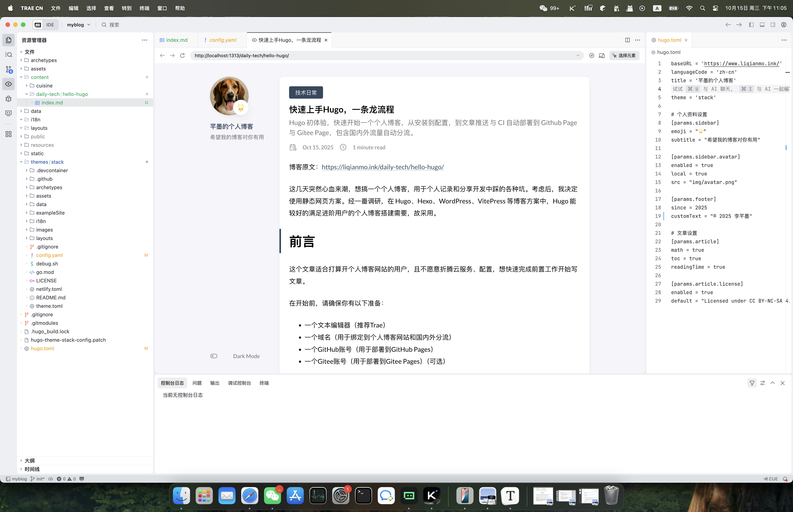
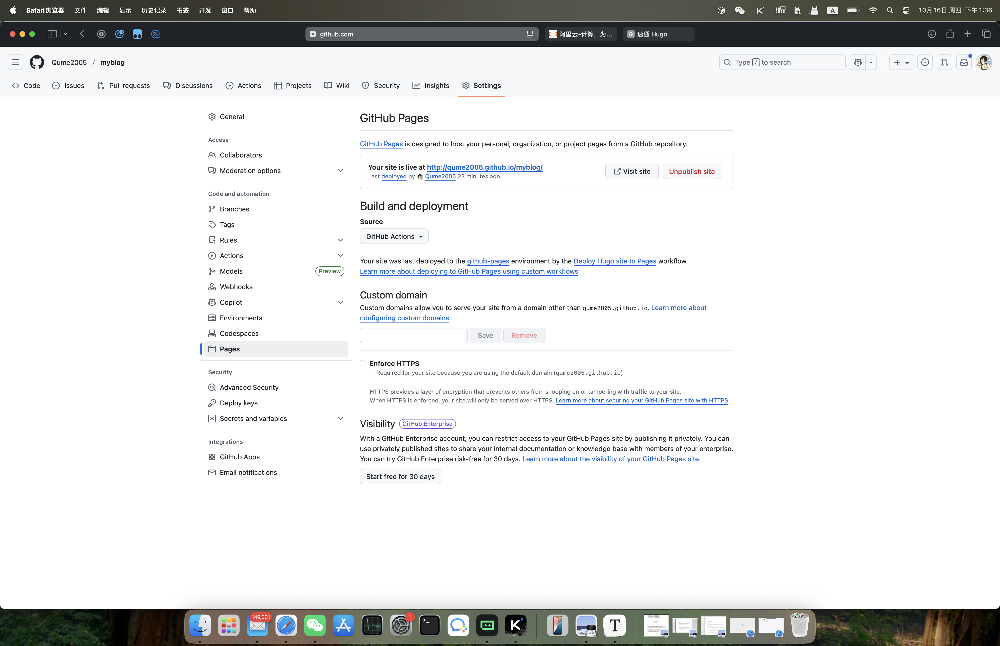

+++
date = '2025-10-15T18:00:15+08:00'
draft = false
title = '速通 Hugo'

description = '快速开始一个个人博客，梦开始的地方。'
tags = [
    'Hugo 系列',
    '个人博客',
    '静态网站',
]
categories = [
    '技术日常',
]
+++

博客原文：[https://blog.liqianmo.ink/daily-tech/hello-hugo/](https://blog.liqianmo.ink/daily-tech/hello-hugo/)


这几天突然心血来潮，想搞一个个人博客，用于个人记录和分享开发中踩的各种坑。考虑后，我决定使用静态网页方案。经一番调研，在 Hugo、Hexo、WordPress、VitePress  等博客方案中，Hugo 能较好的满足进阶用户的个人博客搭建需要，故采用。

# 前言

这个文章适合打算开个人博客网站的用户，且不愿意折腾云服务、配置，想快速完成前置工作开始写文章。

在开始前，请确保你有以下准备：

- 一个文本编辑器（推荐Trae）
- 一个GitHub账号（用于备份和使用GitHub Pages服务）

**如果你已经大致了解过 Hugo，请跳过这段废话，直接到[快速开始](#快速开始)。**

## 笔者的思考——Hugo的定位

Hugo 是一个静态网站生成器，它在Hexo、WordPress等竞品中的优势主要在于**速度快**，可以做到屏幕左边写文章，右边就实时生成页面，对于个人写作用户十分方便。同时 Hugo 相比 WordPress 等动态网站生成器，仅需要部署在 GitHub Page 或Gitee Page 上，速度快且无需担心 DDOS、SEO和云服务费用问题。

如果你是一个**个人写作用户**，想好好写文章，对高度客制化的主题没有需求，且有一定的 git 使用经验，能够完成 `Commit` 和 `Push` 操作，那么可以无脑选择 Hugo。

原因如下：

- Hugo 更适合专注于**文章的用户**，相比之下 Hexo 其实更适合完成企业官网这种对文章数量不多，但对网站外观要求较高的场景。
- 虽然 WordPress 的学习成本低，易上手，但仍需要管理并定期续费虚拟主机或云服务器资源。此类动态网站方案在廉价云服务上速度有些令人不悦，同时难以抵抗 DDOS 攻击。且笔者认为 PHP 本身在安全性上有一定缺陷，可能未来会出现安全漏洞，不利于数据安全。
- Hugo 有许多主题，数量和质量都比较令人满意，容易配置，有合理的可定制性。
- Hugo 的文档格式采用原版 Markdown，语法简洁方便。
- Hugo 深度绑定 Git 工作流，版本管理与文章发布流程简便，文章上传仓库后不易丢失。
- VitePress 适合用于严肃技术文档的编写，普遍用于编写 API 文档、和技术教程等。特点是预渲染静态 HTML，首屏快，SEO 友好，但是会 hydrate 成 SPA，在 JS 受限的环境中可能会有问题。Hugo 则是生成纯静态站点，SEO 与加载速度均优于 VitePress。

# 快速开始

只需按照文章顺序做即可完成前置工作。

## 安装Hugo

Hugo的安装非常简单，你可以在[Hugo的官方网站](https://gohugo.io/getting-started/installing/)找到安装指南。根据你的操作系统，选择对应的安装方法。

## 创建一个新的Hugo站点

先选择一个路径，然后使用以下命令创建Hugo站点：

```bash
hugo new site myblog
```

这将在当前目录创建一个名为`myblog`的新站点。

## 选择一个主题

Hugo有许多精美的主题可供选择。你可以在[Hugo的主题网站](https://themes.gohugo.io/)找到主题。你可以选择一个你喜欢的主题，替换掉下面的 Stack 主题。

这里提供 Stack 主题的快速使用命令

```bash
cd myblog
git init # 初始化 git 仓库
git submodule add --depth=1 https://GitHub.com/CaiJimmy/hugo-theme-stack.git themes/stack # 引用 Stack 主题的仓库
```

## 安装主题

安装完成后，你需要在`myblog`目录下的`config.toml`文件中配置主题。打开`config.toml`文件，在最下面增加行：

```toml
theme = "stack"
```

如果你使用了其他主题，确保`theme`的值为你选择的主题名称。

## 配置个人信息

在`config.toml`文件中，根据你的个人信息，添加相关字段。

这里参考笔者的配置文件，把其中的部分字段改成你自己的：

```toml
baseURL = 'https://blog.liqianmo.ink/' # 你的域名
languageCode = 'zh-cn'
title = '芊墨的个人博客' # 你的博客标题

theme = 'stack'

# 个人资料设置
[params.sidebar]
emoji = "🌟"
subtitle = "希望我的博客对你有用"

[params.sidebar.avatar]
enabled = true
local = true
src = "img/avatar.png"

[params.footer]
since = 2025 # 你的博客开始时间
customText = "© 2025 李芊墨" # 年份和你的姓名

# 文章设置
[params.article]
math = true
toc = true
readingTime = true

# 章节设置
[params]
mainSections = ["cuisine", "daily-tech", "tutorial", "math"] # 你存放文章的文件夹

[params.article.license]
enabled = true
default = "Licensed under CC BY-NC-SA 4.0"
```

然后在`assetsimg/`目录下，添加你的头像图片，命名为`avatar.png`。

这里展示mainSections字段设定后的效果（有点糊，可以点开查看）：



## 添加.gitignore 文件

为了避免将一些临时文件和配置文件提交到 Git 仓库，你需要添加一个`.gitignore`文件。

在项目根目录下创建一个名为`.gitignore`的文件，添加以下内容：

```
# 忽略 Hugo 生成的静态文件
public/
resources/

# 忽略 Stack 主题的缓存文件
themes/stack/assets/cache/

# 忽略 Macos 系统文件
.DS_Store
```

## Commit 你的修改

完成以上配置后，你需要提交你的修改到 Git 仓库。

```bash
git add .
git commit -m "Add Stack theme and configure it"
```

## 创建第一篇文章

现在，你可以创建第一篇文章了。在`myblog`目录下，执行以下命令：

```bash
hugo new daily-tech/hello-hugo/index.md
```

这将在`content/daily-tech/hello-hugo/`目录下创建一个新文件`index.md`。

打开`index.md`文件，你可以看到以下内容：

```markdown
+++
date = '2025-10-16T00:18:27+08:00' # 你的日期这里会不一样
draft = true
title = 'Hello Hugo'
+++

```

然后你只需要按照 Markdown 文档的语法正常写作即可。

笔者博客文档的部分内容，可供参考：

```markdown
+++
date = '2025-10-15T18:00:15+08:00'
draft = false # 设为 false 后，文章才会出现在博客中
title = '速通 Hugo'

description = '快速开始一个个人博客，梦开始的地方。'
tags = [
    'Hugo 系列',
    '个人博客',
    '静态网站',
]
categories = [
    '技术日常',
]
+++

博客原文：[https://blog.liqianmo.ink/daily-tech/hello-hugo/](https://blog.liqianmo.ink/daily-tech/hello-hugo/)  


这几天突然心血来潮，想搞一个个人博客，用于个人记录和分享开发中踩的各种坑。考虑后，我决定使用静态网页方案。经一番调研，在 Hugo、Hexo、WordPress、VitePress  等博客方案中，Hugo 能较好的满足进阶用户的个人博客搭建需要，故采用。

# 前言

这个文章适合打算开个人博客网站的用户，且不愿意折腾云服务、配置，想快速完成前置工作开始写文章。

...
```

## 预览博客

在`myblog`目录下，执行以下命令：

```bash
hugo server
```

这将启动一个本地开发服务器，你可以在文本编辑器中的集成浏览器访问`http://localhost:1313/`来预览你的博客。

如果你的博客内容发生更改，Hugo 会自动重新构建你的博客，浏览器会实时更新最新内容。

## 提交到 GitHub 远程仓库

接下来你可以将这个项目提交到 GitHub 远程仓库，用于备份和版本控制。同时联动 GitHub Pages 服务，实现自动构建和部署。

通过文本编辑器登录 GitHub 账号后执行以下命令

```bash
git add .
git commit -m "Add Hello Hugo article" # 提交时添加文章描述，可以换成你自己的文章标题
git push origin main
```

## 配置 GitHub Pages 服务

在 GitHub 上，你需要配置 Pages 服务，将你的博客项目部署到 GitHub Pages 上。

具体步骤如下：

1. 在 GitHub 上，找到你的博客项目仓库，点击 `Settings` 按钮。
2. 在左侧导航栏中，点击 `Pages` 选项。
3. 在 `Source` 部分，选择 `GitHub Actions`。
5. 点击 `Save` 按钮。
6. 在 `Actions`页中点击 `New workflow`，搜索 `Hugo`，点击 `Configure`按钮，然后 `Commit changes`。
7. 在 `Actions`页中，找到 `Run workflow`按钮，点击触发构建。

等待一段时间，GitHub 会自动构建你的博客项目，并将其部署到 GitHub Pages 上。

你可以在 `Settings` 页面的 `Pages` 部分，查看你的博客网站的 URL。

并且每次你将仓库推送更新到 GitHub 后，GitHub Pages 服务会自动触发构建和部署，你无需手动操作，博客站点会很快完成更新。



## 总结

通过以上步骤，你可以快速搭建一个个人博客网站，开始记录你的技术日常。

祝你开博客愉快！

# 笔者的经验分享

笔者很喜欢在 VsCode 系的文本编辑器中左边写博客，右边看实时预览，这样可以很快的确认文章的格式是否正确，也可以快速的调整样式。（富哥可以多屏协作，应该更爽）

大家每次写作只需要`hugo new xxx/yyy/index.md`一下，创建一个新博文，写完了以后把 `draft` 设为 `false`，`Commit` 之后再推送更新到 GitHub 远程仓库，就能在博客站点上看到了。

# 后续

后续会出更多关于 Hugo 的文章，包括：

- 如何自动构建博客，并更新到 GitHub Pages、Gitee Page 等静态网站托管服务上
- 如何进行国内外访问优化，基于域名 dns 解析分流
